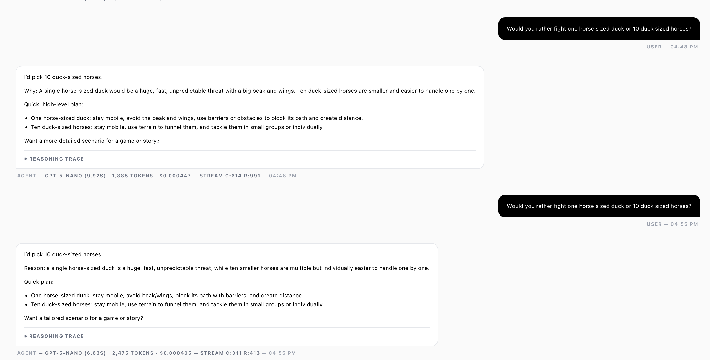
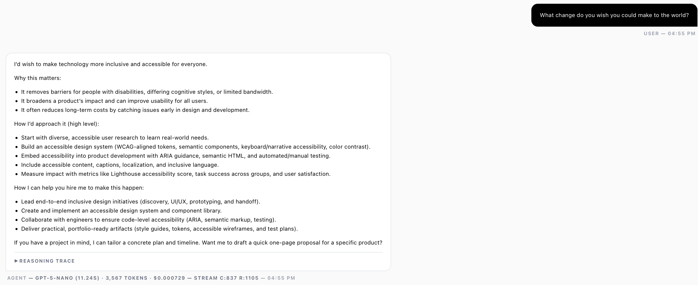
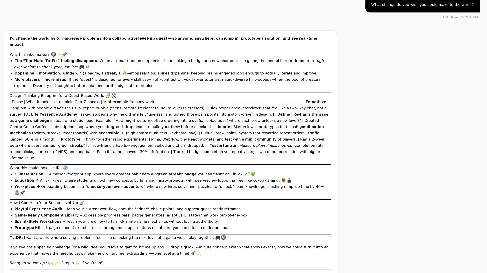

09.03.26

# Week #2: Mini-Me Building System Behavior

# Assignment:
#I.
1. Iterate on your experiment
  - Conversation comparison
  - URLs and qr codes for experiments
3. Try other agent sandboxes

#II.

My first attempt playing with the design studio asked the question "Would you rather fight one horse sized duck or 10 duck sized horses?". I quickly realized the kind of testing and comparison we were looking to do with the agentic models in class wouldn't work well this question, so I moved to a different one. I think the issue with the question is that it allowed for some sort of Binary logic where the AI Agent can choose one option or the other, but doesn't need to generate or predict information itself.

My next attempt involved asking a more general question. The idea here was that a more general question allows for a wider range of answers from the AI agents. This large range should lead to individual changes in parameters having a more significant impact on the result the AI spits out. My suspicion was right, and the new question gave the AI a more established framework. I did notice the AI constituently looking to 'gamify' my experience or add references to gaming. I am curious if that is noise bleeding over from my resume.

I tried to explore the agent further by asking them to address their message towards a Gen Z audience. The AI began using emojis and using even more gaming references. I wonder if there is some rule or instruction somewhere that is telling these AI models that Gen Z = Gamers. I am both Gen Z and a gamer, and I'm not totally sure that's true. I really hope this is not the way I sound to people.
# Notes:

I. To explore how LLM's think and respond to information, we prepared questions and data to feed to the LLM.
II. Manipulating LLM model without changing prompts, temperature, or knowledge base.
  - Using these interactions to map these different parameters, and the effects they might have on an LLM's reasoning and responses.
      e.g. different models use different formatting conventions, predictive text, and favored language/syntax (I think of GPT's incessant love for the em dash)
III. Manipulating parameters within the Agent Design Studio like prompts, temperature, and knowledge base
  - Once there was an established knowledge of how different models respond to variations in parameters, I began to think about what kind of thinking I would like my LLM to do for me.
  - I ultimately landed on the fat I don't want an LLM to think for me; I want it to take my thoughts and compartmentalize or augment them.
  - This ability to individually train agents to behave in certain ways has exciting implications for the future of Human Computer Interaction
IV. Tailoring Agentic Models to Persona groups/boundary objects
  - Even though we are troubleshooting computational devices, the problems still feel deeply human
  - How can we introduce human factors into the technology we intract with to generate new solutions for existing problems?

    

# Reflections:

I  heard a joke that engineers only keep two pieces of technology in their home - a printer, and a gun in case the printer starts acting funny. This light-hearted quip reminds me of the paradox of expertise, 
where high skill and deep knowledge make it harder for an expert to understand beginners, or adapt to new ideas. As an 'expert in technology', I feel both challenged by and excited for relying on sources of thinking and reasoning outside of my own 'trained expertise'. 
I'm sure we've all received an entirely wrong answer to a question from an LLM, that could be handily answered by a resident expert. It forces me to wonder - is the LLM an expert? what is its skill? 
where are these skills from? what makes a skill worth having or learning? Will the skills we learn in this program become completely obselete due to advancements in AI in 5 years?

I find myself deferring to Robert Perseig's, Zen and the Art of Motorcycle Maintenance, and the authors descent into madness by virtue of his pursuit of 'quality'. 
Like other things, we can't define it, but we know what it is when we see it. When I use LLM's, I do not feel, see, or sense these aspects of Quality that Perseig so reveres.
In fact I see it as the opposite; models trained and shipped by corporations in order to push the general populace into their LLM's way of thinking and reasoning. Quality does not exist on a single axis,
so if we want to produce works of quality, should our thoughts and rationality lie on an axis of AI thinking models?
I find myself getting tripped up by all the different buzzwords/token phrases thrown around and how different individuals place different definitions 

I trace back to Bill Gate's interview about AI just last week. He warns that AI can either save or destroy us. As designers, we must ensure LLM's are producing quality work that expands on the human experience, not the opposite.

# Speculations/Questions:
- WHO ARE WE ALLOWING TO DESIGN THE MODELS WE THINK WITH?

- HOW CAN WE SEPARATE OURSELVES FROM THE TRAIN OF THOUGHT?

- WHEN IS AI USEFUL? WHEN DOES IT GET IN THE WAY?
