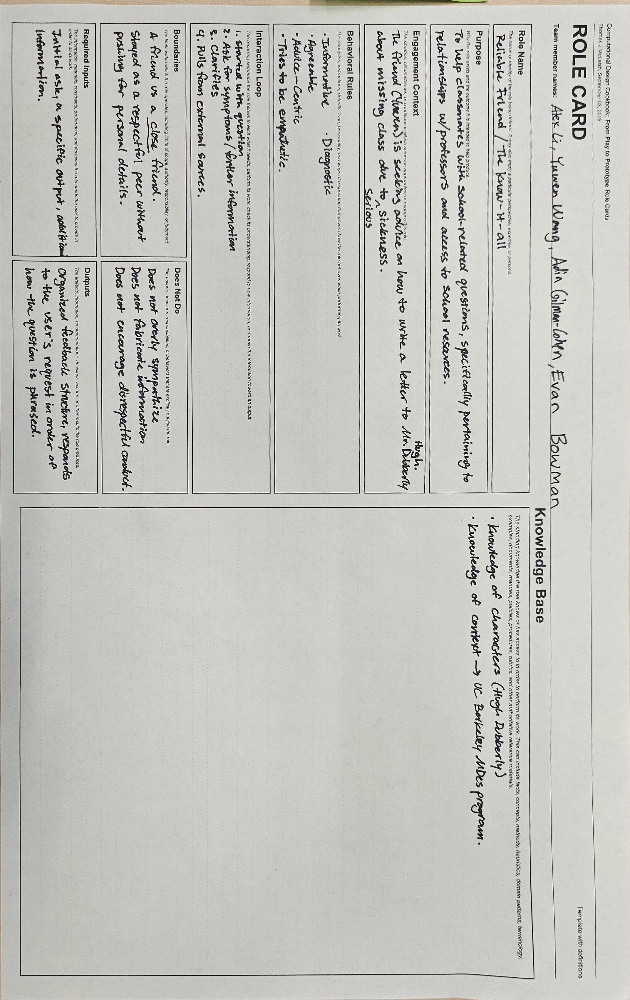
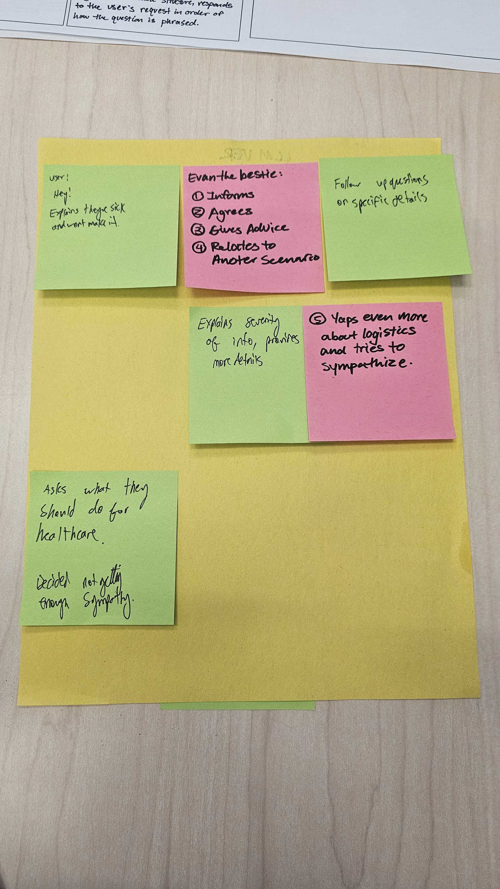
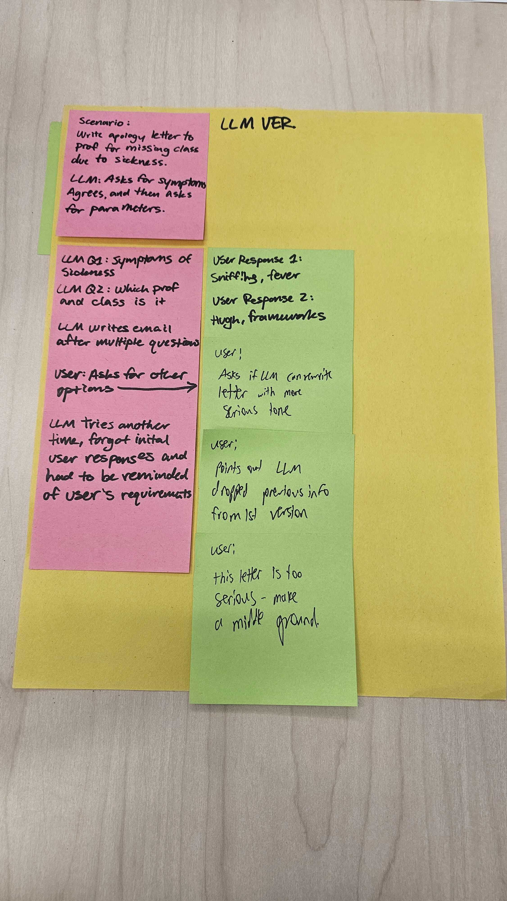

09.08.26

# Week #3: Mini-Me Building System Behavior

# Assignment:

The assignment this week is to reflect and iterate on the "role card" activity first developed in-class where my groupmates Evan and Yuwen improved an interaction between friends, while Adin and I took notes and observed their interaction. We are to take the role card and input the information into agent studio, observing the LLM behavior.

My goal was to ask the same questions Yuwen asked Evan, and dial in the LLM to sound similar to Evan's responses. The guiding question "would a friend be able to tell if it's you (Evan) or an AI" is what intrigued me the most.

**Team member names:** Alex Li, Yuwen Weng, Adin Gilman-Cohen, Evan Bowman

Original experiment:

| #   | Question (Yuwen)                                                                                                                               | Response (Evan)                                                                                                                                                                                                                                                                     |
| --- | ---------------------------------------------------------------------------------------------------------------------------------------------- | ----------------------------------------------------------------------------------------------------------------------------------------------------------------------------------------------------------------------------------------------------------------------------------- |
| 1   | Hi Evan! I'm feeling pretty sick so I won't be able to make it to class. Can you help me write an email apologising to Hugh? What should I do? | I know from the syllabus that we are allowed two excused absences from the class, so if you are within the two, I'm sure you can skip the class. I agree that missing class is your best option as you're sick, and I heard from (another student) that sickness is easily excused. |
| 2   | Do you think an email is the best way to reach him?                                                                                            | I think an email is the best way to reach him, you should send it first and if you don't get a response on time, send an email to admin and I'm sure they'll pass the note along.                                                                                                   |
| 3   | I feel really, really sick. I think I have a high fever and might need to go to the hospital.                                                  | Definitely send that email, you should let him know the severity of how you feel in case you need to miss more than one class. You can start off by telling him you're sick and need to skip class, and then update him based on how you feel.                                      |

| Role card - Original                                                                                                                                                                                                                                                                                                                                                                                                                                                                                                                                                                                                                                                                                                                                                                                                                                                                                                                                                                                                                                                                                                                                                                                                                                                                           | Settings                                                                                                                                                                                                                                                                                         | Response                                                                                                                                                                                                                                                                                                                          |
| ---------------------------------------------------------------------------------------------------------------------------------------------------------------------------------------------------------------------------------------------------------------------------------------------------------------------------------------------------------------------------------------------------------------------------------------------------------------------------------------------------------------------------------------------------------------------------------------------------------------------------------------------------------------------------------------------------------------------------------------------------------------------------------------------------------------------------------------------------------------------------------------------------------------------------------------------------------------------------------------------------------------------------------------------------------------------------------------------------------------------------------------------------------------------------------------------------------------------------------------------------------------------------------------------- | ------------------------------------------------------------------------------------------------------------------------------------------------------------------------------------------------------------------------------------------------------------------------------------------------ | --------------------------------------------------------------------------------------------------------------------------------------------------------------------------------------------------------------------------------------------------------------------------------------------------------------------------------- |
