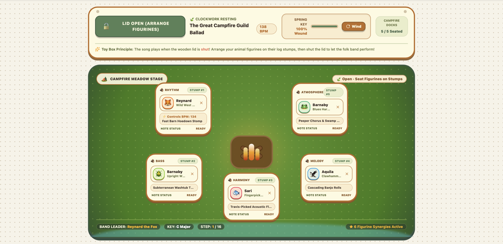

09.15.26

# Week 4: Mini-Me Building System Behavior - 

# Assignment:
### Homework - Journal Part 1
**Publish and Test a Basic Prototype App**  
  1. Complete the AI Studio → GitHub → Vercel publishing process using your basic app. 
  2. Open the Vercel URL in a browser where you are not signed in and confirm that the app loads.  
  3. Share the URL with at least one classmate. Ask them to check the page, navigation, buttons, and other available interactions.  
  4. If something does not work, return to AI Studio and explain:  
    a. What you expected to happen.  
    b. What happened instead.  
    c. Where the app will be deployed.  
    d. Use simple, direct language. For example: “I am deploying this app on Vercel. I expected the button to open the next page, but nothing
happens after deployment. Please identify and fix the problem.”  

### Homework - Journal Part 2
**Deploy Your Agent**  
1. Choose an API path:  
2. Ask AI Studio what is needed to deploy your letter-writing agent on Vercel, including the exact environment variable name required for the
Gemini API key.**  
3. Complete the AI Studio → GitHub → Vercel publishing process using your letter-writing agent.**  
4. In Vercel, add an environment variable using the name identified by AI Studio and enter your Gemini API key as its value.**  
5. Deploy or redeploy the app. You will be prompted to do this in Vercel after you add the variable.**  
6. Open the Vercel URL and confirm that the agent loads.**  
7. Test the deployed agent using the standardized prompts or interaction script you used in AI Studio.**   
8. Share the URL with at least one classmate and ask them to try the agent.**  
9. If something does not work, return to AI Studio and explain:  
a. What you expected to happen.  
b. What happened instead.  
c. Where the app is deployed.  
d. Use simple, direct language. For example: “I am deploying this app on Vercel. I expected the agent to respond after I submitted the
form, but nothing happens after deployment. Please identify and fix the problem.”**  
10. Continue modifying, publishing, and testing the agent until the basic experience works.**  
11. Add the following to your experiment journal:  
a. Your Vercel URL.  
b. Whether you used the Free Tier or $5 Prepaid Tier.  
c. Any differences between the agent’s behavior in AI Studio and on Vercel.  
d. A brief note about what worked or broke.**  
5. Continue modifying, publishing, and testing the app until the basic experience works.**  
6. Add your Vercel URL and a brief note about what worked or broke to your experiment journal.**  

## Deliverable:

### Part 1:
**Prompt 1:** Make me an app that deconstructs songs into values that could be used to reconstruct songs into other arrangements through MIDI interactions

**Prompt 2:** this application will be used in the development of a toy music box that uses 5 figurines of different personas (Fox, Eagle, Beetle, Salmon, Frog) that can be placed into 5 different docking positions on a physical box. The objective is that each of the figurines represents a musical 'persona' that brings their own unique perspective to the composition of the song that plays when the lid of the music box is shut. An example would be that the figurine place in the drums docking position would not only determine the drum sounds and patterns being played, but also the most rudimentary aspects of the song composition like bpm. The idea is that the figurines can be combined in dock positions differently to create new interesting compositions as an exploration of physical digital interactions and interpersonal dynamics in musical compositions. The instruments used should be based on 'campfire Wild West folk bands' as the box will be made to look like a sort of campfire diorama

**Prompt 3:** clean up the app visuals by differentiating them from conventional AI user design. focus on using Nintendo like animal crossing inspired design conventions with saturated colors interesting textures and non traditional shapes. Stay away from square cells with colored radiuses borders. focus on the functionality of the app as an experimental workplace for the final product. somewhere to work out which instrument sounds keys, bpms, swings, and other measurable aspects of the song composition can be parametrized

I had some coworkers check my app out over the weekend and provide some feedback. The general consensus is it that it functions as expected, but lacks any dynamic interactions or style that would incentivize and individual to continue using the app. I tried to think of ways why, where, and how people might use an app like this. Obviously the use case was highly tailored to my own experience, so hearing different perspectives forced me to consider innovative use cases for the app as well as current competitors.

### Part 2:

Published Letter Writer: [Reliable Peer](https://vercel.com/mdes/reliable-peer-ai-letter-writer)
 - Used Free Tier
 - I noticed the 'behavior' was the same, but since I couldn't understand the agents thought process here and could only interact with the GUI/skin over the agent, it was hard to tell what they were really doing
 - **What worked?:** The app does everything I wanted it to do, although still feels a little pragmatic and impersonal, if I were to take another pass I would make the agent feel more interactive within the app itself to get closer to the real world experience of talking to a friend
 - **What didn't work?:** I was having some trouble getting the naming conventions right between Vercel GitHub and gemini studio
 - the AI keeps wanting to add in extra unnecessary features that detract from the main concept
## Observations:

# Lecture Notes:

## Reflections:

## Speculations/Questions:
