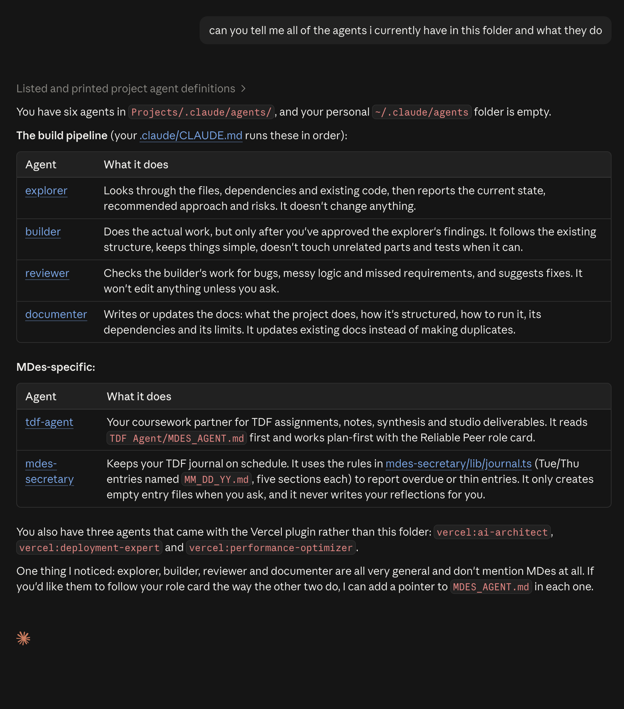

09.22.26

# TDF Journal — 09.24

---

## Assignment

- Followed [Agent Project Configuration](https://github.com/kommanderpi/OYE) to setup agentic project workflow within computer

### Agent Setup:
### Agent Choice: 
After asking TJ about his preferred workflow I ended up choosing a paid Claude membership over Codex. I'm enjoying the workflow so far, but am running into some of the token issues that Joris mentioned.
### Agent Location:
### Choice Reason:
### Permissions Given:
### What does each agent do/why?
---

## Lecture Notes

### Object Detection: Big Picture
1. Input Image
2. Backbone/Feature Maps
3. Detection Head
4. Candidate Detections
5. Filtering + NMS
6. Final Detections

What Gets Saved?
- Box coordinates
- Class Labels
- Confidence Scores

### Object Detection: Apply Object Prediction Head Everywhere
1. Feature Map Grid
2. Detection Head at one location
3. Same head at all locations
4. Each location emits predictions

One head, reused everywhere, scans the feature map for possible objects.

### Object Detection: Many candidates
1. Input Image
2. Feature Map Grid
3. Many location prediction boxes
4. Many candidate boxes

---

## Reflections

**What challenges did you face?**
  - I had setup my agent ahead of time, so I sometimes had trouble finding the files referenced in the tutorial since I was parsing through the noise

**What agents did you create?**
  - I created a single master agent based off my research from the first project in the class. I think I am looking to create additional focused agents moving forward that I can manage like a design team.

**Did you create any custom agents?**
  - Not yet

**Were your agents setup to be global or local (all projects vs agent per project)****
  - My plan is to setup one overall global agent (with possibilities of more for designated tasks)
  - I have noticed from a lot of my work experiences within design that management takes on 3 heads: finances (resource allocation and generation), production (industrial engineering, workflows, 

---

## Speculations/Questions
